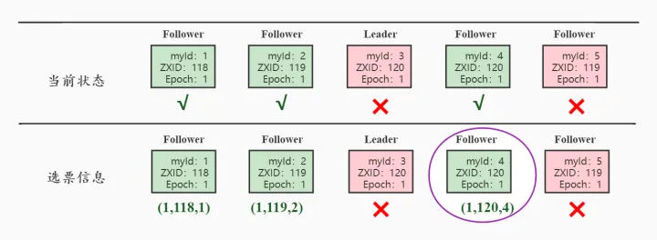

# Zookeeper 集群中是怎样选举leader的

## zookeeper集群中服务器被划分为以下四种状态：
+ LOOKING：寻找Leader状态。**处于该状态的服务器会认为集群中没有Leader，需要进行Leader选举**；
+ FOLLOWING：跟随着状态，说明当前服务器角色为Follower；
+ LEADING：领导者状态，表明当前服务器角色为Leader；
+ OBSERVING：观察者状态，表明当前服务器角色为Observer。

## Leader选举的触发时机
+ 集群启动，这个时候需要选举出新的Leader；
+ Leader服务器宕机；

## 第一次启动Leader选举
假设想在的有三台机器搭建集群：

1. **每个Server发出一个投票投给自己**。当server1启动的时候，为Looking状态，对应的myid记为1，ZXID为0，他先投自己一票，此时他的投票为(1,0);然后需要把自己的选票发给集群中的其他机器。
2. server2这个时候也启动了，也是Looking状态，也先投自己一票，也就是(2,0)，然后需要把自己的选票发给集群中的其他机器。
3. 接受来自各个服务器的投票。**集群的每个服务器收到投票后，首先判断该投票是否有效，如检查是否是本轮投票、是否来自LOOKING状态的服务器；**
4. **处理投票。**针对每一个投票，服务器都需要将别人的投票和自己的投票进行PK，PK的规则如下：
5. **优先检查ZXID。**ZXID比较大的服务器优先作为Leader；
6. **如果ZXID相同，那么就比较myid。**myid较大的服务器作为Leader服务器。

对于Server1而言，它的投票是(1, 0)，接收Server2的投票为(2, 0)，首先会比较两者的ZXID，均为0，再比较myid，此时Server2的myid最大，**于是更新自己的投票为(2, 0)，然后重新投票，对于Server2而言，其无须更新自己的投票，只是再次向集群中所有机器发出上一次投票信息即可。**

1. **统计投票**。每次投票后，服务器都会统计投票信息，判断是否已经过半机器接收到相同的投票信息，对于Server1、Server2而言，都统计出集群中已经有两台机器接受了(2, 0)的投票信息，此时便认为已经选出了Leader。  

2. **改变服务器状态**。一旦确定了Leader，每个服务器都会更新自己的状态，如果是Follower，那么就变更为FOLLOWING，如果是Leader，就变更为LEADING。  

3. 这个时候Server3启动了， 发现集群中已经有了Leader，就建立连接并把自己的状态置为Following。  

## 非第一次启动Leader选举

  

在zookeeper运行期间，即便有新服务器加入，也不会影响到Leader，**新加入的服务器会将原有的Leader服务器视为Leader，进行同步。但是一旦Leader宕机了，那么整个集群就将暂停对外服务，进行新一轮Leader的选举**，其过程和启动时期的Leader选举过程基本一致。假设正在运行的有Server1、Server2、Server3三台服务器，当前Leader是Server2，若某一时刻Leader挂了，此时便开始Leader选举。这里我们假设server3为原本的Leader，其余四台均为Follower，某一时刻server3和server5都宕机了，那么选举过程如下：

1. 变更状态。Leader宕机后，余下的非Observer服务器都会将自己的服务器状态变更为LOOKING，然后开始进行Leader选举流程；
2. **每个Server会发出一个投票**。在这个过程中，需要生成投票信息(Epoch，ZXID，myid)，对应的server1，server2，server4的选票信息如上图，；其中Leader选举的规则是
3. EPOCH大的直接胜出
4. EPOCH相同，事务大的胜出
5. 事务ID相同，服务器ID大的胜出

之后各个Looking状态的服务器会交换信息，最终会多数选举server4，也就更改为(1,120,4)的选票信息。

1. 接收来自各个服务器的投票。与启动时过程相同；
2. 处理投票；
3. 统计投票；
4. 改变服务器的状态，此时server4成为新的Leader。

