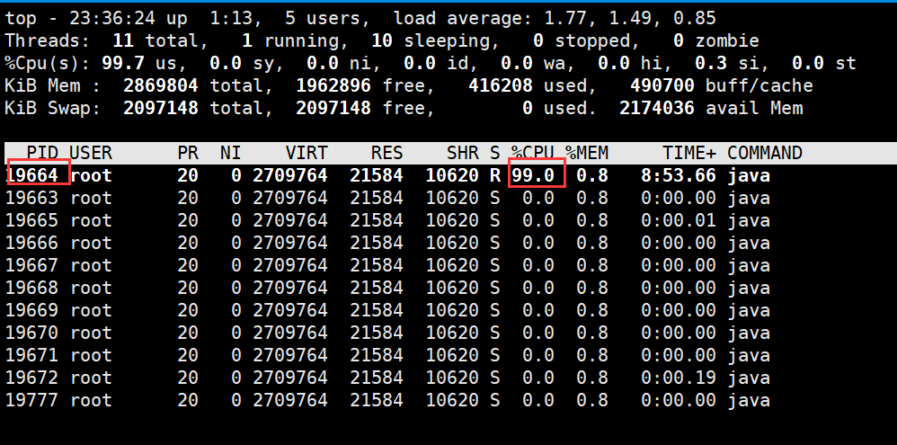

# CPU飙高问题如何排查

<font style="color:rgba(0, 0, 0, 0.82);">线上系统CPU飙高问题可以按以下步骤排查：</font>

1. **<font style="color:rgba(0, 0, 0, 0.82);">确定问题进程</font>**

<font style="color:rgba(0, 0, 0, 0.82);">首先，使用top命令找出占用CPU较高的Java进程：</font>

```plain
top
```

<font style="color:rgba(0, 0, 0, 0.82);">找到对应的进程ID (PID)。</font>


2. **<font style="color:rgba(0, 0, 0, 0.82);">获取线程信息</font>**

<font style="color:rgba(0, 0, 0, 0.82);">使用top -Hp</font><font style="color:rgba(0, 0, 0, 0.82);"> </font><font style="color:rgba(0, 0, 0, 0.82);"><PID>命令查看该进程内各个线程的CPU占用情况：</font>

```plain
top -Hp <PID>
```

<font style="color:rgba(0, 0, 0, 0.82);">记录下占用CPU较高的线程ID。</font>



3. **<font style="color:rgba(0, 0, 0, 0.82);">转换线程ID为十六进制</font>**

<font style="color:rgba(0, 0, 0, 0.82);">使用printf命令将线程ID 19664 转换为十六进制，结果为</font> 0x4cd0<font style="color:rgba(0, 0, 0, 0.82);">：</font>

```java
printf "%x\n" <线程ID>
```

4. **<font style="color:rgba(0, 0, 0, 0.82);">获取线程堆栈</font>**

<font style="color:rgba(0, 0, 0, 0.82);">使用jstack命令获取进程的线程堆栈信息：</font>

```java
# 得到线程堆栈信息中 4cd0 这个线程所在行的后面10行，从堆栈中可以发现导致cpu飙高的调用方法
jstack 19663|grep -A 10 4cd0
```


5. **<font style="color:rgba(0, 0, 0, 0.82);">代码分析</font>**

<font style="color:rgba(0, 0, 0, 0.82);">根据堆栈信息，查看相关的Java代码。以下是一些可能导致CPU飙高的代码示例：</font>

<font style="color:rgba(0, 0, 0, 0.82);">示例1：死循环</font>

```java
while (true) {  
    // 耗CPU的操作  
}
```

<font style="color:rgba(0, 0, 0, 0.82);">示例2：频繁的垃圾回收</font>

```java
List<Object> list = new ArrayList<>();  
while (true) {  
    list.add(new Object());  
    if (list.size() > 10000) {  
        list.clear();  
    }  
}
```

<font style="color:rgba(0, 0, 0, 0.82);">示例3：不当的线程同步</font>

```java
public class BadSynchronization {  
    private static final Object lock1 = new Object();  
    private static final Object lock2 = new Object();  

    public static void method1() {  
        synchronized (lock1) {  
            synchronized (lock2) {  
                // 操作  
            }  
        }  
    }  

    public static void method2() {  
        synchronized (lock2) {  
            synchronized (lock1) {  
                // 操作  
            }  
        }  
    }  
}
```

<font style="color:rgba(0, 0, 0, 0.82);">示例4：密集的计算操作</font>

```java
public long fibonacci(long n) {  
if (n <= 1) return n;  
return fibonacci(n-1) + fibonacci(n-2);  
}  

// 调用  
long result = fibonacci(50);
```

6. **<font style="color:rgba(0, 0, 0, 0.82);">使用性能分析工具</font>**

<font style="color:rgba(0, 0, 0, 0.82);">可以使用诸如Arthas、JProfile等Java性能分析工具进行更深入的分析。</font>

7. **<font style="color:rgba(0, 0, 0, 0.82);">查看GC日志</font>**

<font style="color:rgba(0, 0, 0, 0.82);">如果怀疑是GC问题，可以查看GC日志：</font>

```java
jstat -gcutil <PID> 1000
```

8. **<font style="color:rgba(0, 0, 0, 0.82);">检查系统资源</font>**

<font style="color:rgba(0, 0, 0, 0.82);">使用vmstat、iostat等命令检查系统资源使用情况，排除是否为系统资源问题。</font>

<font style="color:rgba(0, 0, 0, 0.82);">通过以上步骤，我们可以定位到导致CPU飙高的具体代码位置，然后进行相应的优化。常见的优化方法包括：优化算法、增加缓存、调整线程池参数、优化数据库查询等。在进行优化时，要注意进行充分的测试，以确保修改不会引入新的问题。</font>


